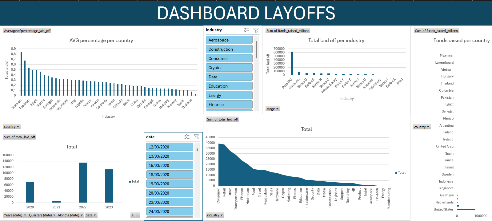
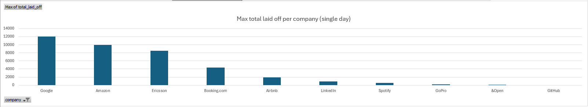
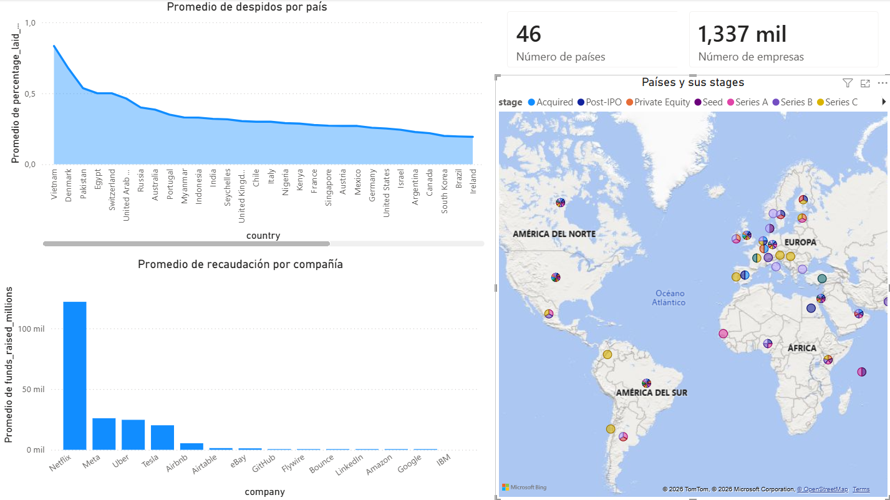

# layoffs-sql-data-cleaning
Data cleaning and exploratory analysis of a global layoffs dataset using MySQL, with supporting Excel and Power BI dashboards.

# Global Layoffs Data Cleaning & Exploratory Analysis

## Project Overview

This project focuses on cleaning and analysing a global layoffs dataset using MySQL.  
The main objective was to transform a raw and inconsistent dataset into a clean, structured and analysis-ready table.

After the cleaning process, I used Excel and Power BI to perform exploratory analysis and create simple dashboards to communicate the main trends in the data.

## Tools Used

- MySQL
- Excel
- Power BI
- GitHub

## Dataset

The dataset contains information about global company layoffs, including:

- Company
- Location
- Industry
- Total employees laid off
- Percentage laid off
- Date
- Company stage
- Country
- Funds raised

## Main Objective

The main goal of this project was to practise a realistic data cleaning workflow using SQL, including duplicate removal, standardisation, missing value handling and exploratory analysis.

## Data Cleaning Process

The cleaning process included:

1. Creating a staging table to preserve the original raw data.
2. Identifying and removing duplicate records.
3. Standardising text fields such as company, industry and country.
4. Converting date values into a proper date format.
5. Handling blank and NULL values.
6. Removing records with insufficient information.
7. Preparing the final cleaned dataset for analysis.

## SQL Techniques Used

- CTEs
- ROW_NUMBER()
- PARTITION BY
- GROUP BY
- HAVING
- UPDATE statements
- CASE expressions
- Date conversion
- NULL handling
- Data standardisation

## Exploratory Analysis

After cleaning the data, I analysed the dataset to answer questions such as:

- Which companies had the highest number of layoffs?
- Which industries were most affected?
- Which countries had the highest layoff activity?
- How did layoffs evolve over time?
- What company stages were most represented in the dataset?

## Excel and Power BI Visualisation

Excel and Power BI were used as supporting tools to create simple visual summaries of the cleaned dataset.

The visual analysis included:

- Layoffs by year
- Average percentage laid off by country
- Total layoffs by industry
- Funds raised by company and country
- Layoffs by company on a single day

## Dashboard Preview

## Key Insights

Some of the main findings from the analysis were:

- Layoffs were highly concentrated in specific companies and industries.
- The United States represented a significant share of the total layoffs.
- 2022 and 2023 showed higher layoff activity compared with previous years.
- Some companies with high funding levels still experienced significant layoffs.
- Consumer, retail, transportation and technology-related sectors appeared among the most affected areas.

## What I Learned

This project helped me practise a complete data cleaning workflow using SQL and understand how raw data must be prepared before it can be reliably analysed or visualised.

It also reinforced the importance of documenting each cleaning step clearly so that the process can be reviewed, reproduced and understood by others.

## Files Included

- `sql/`: SQL script used for data cleaning and exploratory analysis.
- `data/`: Raw and cleaned dataset files.
- `excel/`: Excel analysis and dashboard.
- `powerbi/`: Power BI dashboard file.
- `images/`: Dashboard screenshots used in this README.

## Conclusion

This project demonstrates my ability to clean, transform and analyse raw datasets using SQL, and to communicate the results through simple Excel and Power BI visualisations.
